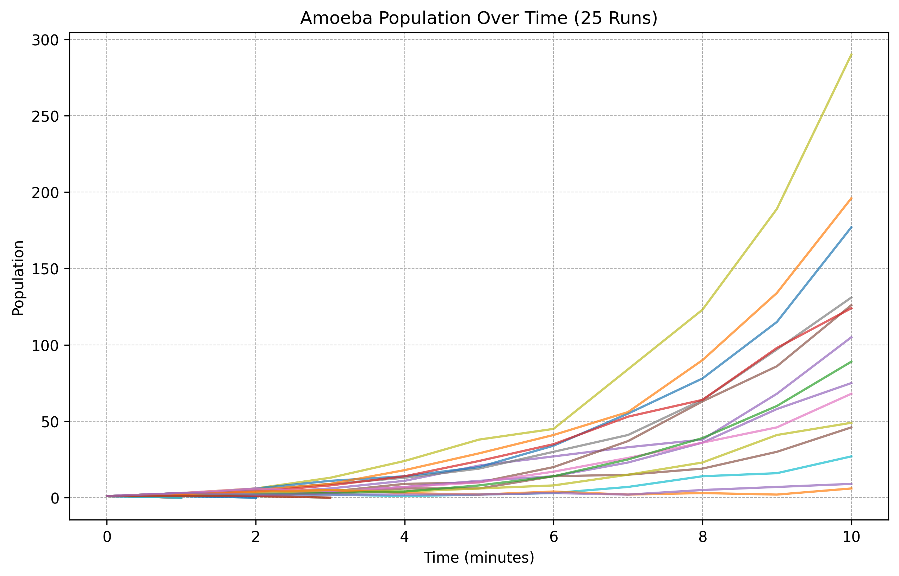

# Amoeba Extinction Simulation

This project simulates a probabilistic model of amoeba reproduction and extinction, inspired by an interview question reportedly asked at JPMorgan. The goal is to study extinction dynamics under various probabilistic rules governing amoeba behavior and to visualize key statistical properties of the process.

## Problem Description
Imagine a single amoeba living in a pond. Every minute, it undergoes one of four random behaviors, each with assigned probability:

- **Die** (population decreases by 1) with probability `p_die`

- **Stay the same** (no change in population) with probability `p_stay`

- **Divide into 2** (produces 1 offspring) with probability `p_double`

- **Divide into 3** (produces 2 offspring) probability `p_triple`

Each offspring behaves independently and follows the same set of probabilistic rules in the next minute. This process continues recursively.

The question is:

**What is the probability that this population eventually dies out?**

We simulate the evolution of an amoeba population where each amoeba independently undergoes one of four actions at each discrete time step. The simulation starts with a single amoeba and proceeds step by step. If the population ever drops to zero, extinction occurs. If it survives for a maximum number of steps or grows beyond a specified threshold, the simulation halts early. 

**Note**: While this problem can be solved analytically with basic probability theory and recurrence relations, it’s much more fun to simulate the process and watch the stochastic amoeba populations grow (or collapse!)

## Key Features and assumptions

- **Extinction Probability Estimation**: Estimates the likelihood of extinction across many simulation runs.
- **Extinction Time Histogram**: Visualizes the distribution of time steps at which extinction occurs.
- **Population Evolution Traces**: Tracks and plots the evolution of amoeba population over time in individual sample runs.
- **Log-scale Visualization**: Population plots use a log-scale to better capture exponential growth patterns.
- **Early Termination Heuristic**: Simulations are stopped early if population exceeds a threshold (e.g., 25), assuming extinction is highly unlikely beyond that point.
- **Exported Visuals**: Automatically saves plots for further inspection or reporting.

## Spoiler Alert: Visualization

- Histogram of extinction times with percentage labels per time bin.
- Time series plots of individu
al sample runs with extinction threshold line.

<p align="center">
  
  
</p>

## ⚙️ Configuration

You can tune the following parameters in the script:

```python
# Probabilities (must sum to 1)
p_die = 0.25
p_stay = 0.25
p_double = 0.25
p_triple = 0.25

# Simulation controls
max_steps = 100         # Max number of time steps
population_threshold = 25  # Early stop threshold for large population to conserve computing resources and time
num_simulations = 100000     # Number of trials

